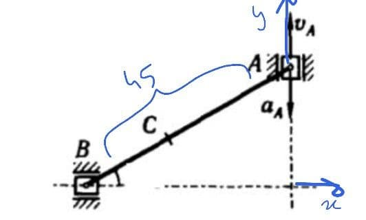
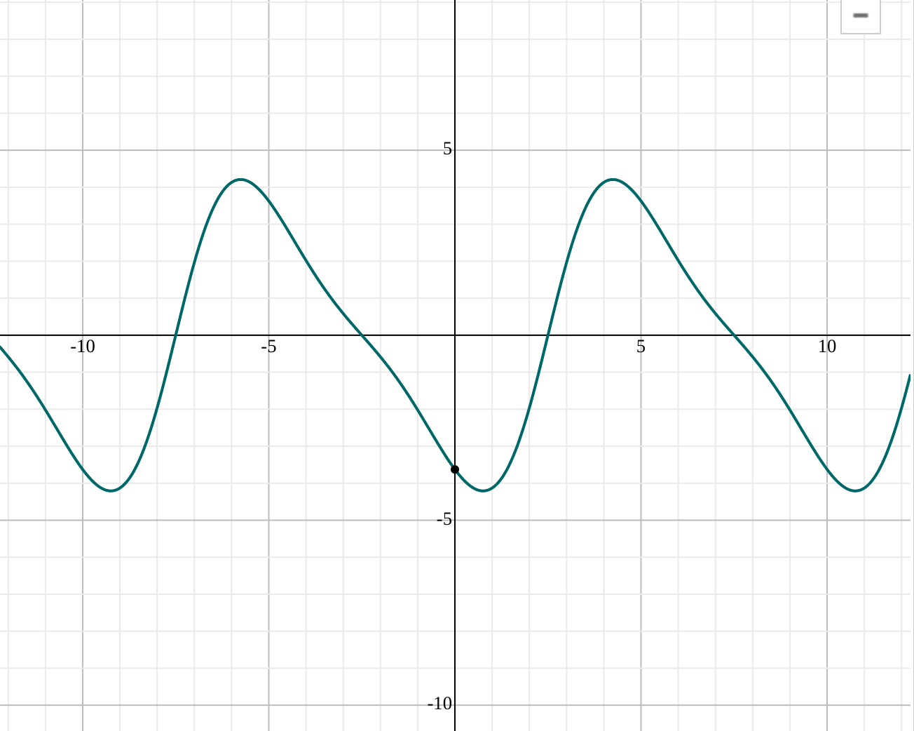
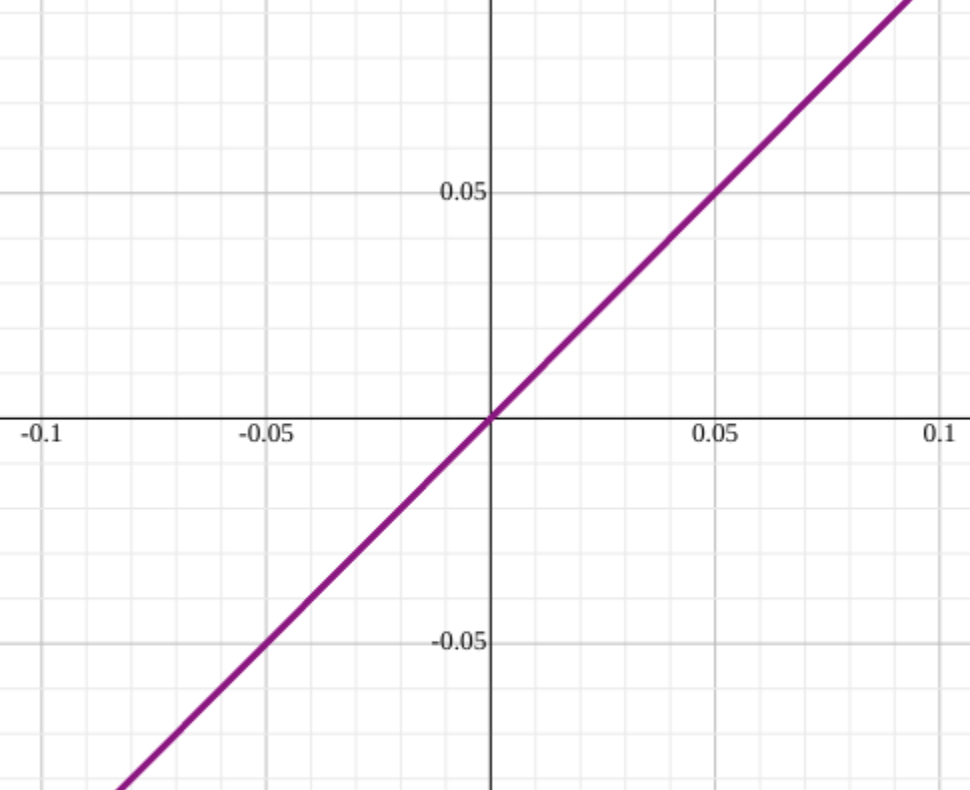

# Homework of Week 1

## Task 3

[Link](https://www.geogebra.org/m/drr8egae) to the simulation

First, we need to find the positions of points A, B, C respectively.

According to the axis shown in the figure above with the given magnitudes: 
$$
y_A (t) = 22.5 + 10 sin (\frac{\pi t}{5} )
$$

$$
t \in [0, 10]
$$

$$
x_A (t) =0
$$

$$
x_B(t)= − \sqrt{AB ^2 − y_A (t)^2 }
= − \sqrt{45 ^2 −(22.5^2 +45 ×10×sin(\frac{\pi t}{5})+ 100 sin^2(\frac{\pi t}{5}))}
$$

$$
y_B (t) =0
$$

$$
x_c= x_B  + \frac{1}{3}(x_A − x_B)
= \frac{2}{3} x_B
$$ { }

$$
y_c(t) = y_B (t) + \frac{1}{3}(y_A − y_B)
$$

Now we can derive the previous posistion equations for the first and second time to obtain velocities and accelerations.
$$
V_B (t)= x_B' = \frac{-125.66370\dots \sin \left(0.62831\dots t\right)\cos \left(0.62831\dots t\right)-282.74333\dots \cos \left(0.62831\dots t\right)}{2\sqrt{-100\sin ^2\left(0.62831\dots t\right)-450\sin \left(0.62831\dots t\right)+1518.75}}
$$

$$
V_C (t) = x_c'= \frac{2}{3} x_B = \frac{0.33333\dots \left(-125.66370\dots \sin \left(0.62831\dots t\right)\cos \left(0.62831\dots t\right)-282.74333\dots \cos \left(0.62831\dots t\right)\right)}{\sqrt{-100\sin ^2\left(0.62831\dots t\right)-450\sin \left(0.62831\dots t\right)+1518.75}}
$$

The following is the plot for velocity of  B , C.

and derive once again to find the acceleration:
$$
a_B(t) = V_B' (t)=\frac{\left(-78.95683\dots \cos \left(1.25663\dots t\right)+177.65287\dots \sin \left(0.62831\dots t\right)\right)\left(-100\sin ^2\left(0.62831\dots t\right)-450\sin \left(0.62831\dots t\right)+1518.75\right)-0.5\left(-125.66370\dots \sin \left(0.62831\dots t\right)\cos \left(0.62831\dots t\right)-282.74333\dots \cos \left(0.62831\dots t\right)\right)^2}{2\left(-100\sin ^2\left(0.62831\dots t\right)-450\sin \left(0.62831\dots t\right)+1518.75\right)\sqrt{-100\sin ^2\left(0.62831\dots t\right)-450\sin \left(0.62831\dots t\right)+1518.75}}
$$

$$
a_c(t) = V_C' (t)=
\frac{0.33333\dots \left(\left(-78.95683\dots \cos \left(1.25663\dots t\right)+177.65287\dots \sin \left(0.62831\dots t\right)\right)\left(-100\sin ^2\left(0.62831\dots t\right)-450\sin \left(0.62831\dots t\right)+1518.75\right)-0.5\left(-125.66370\dots \sin \left(0.62831\dots t\right)\cos \left(0.62831\dots t\right)-282.74333\dots \cos \left(0.62831\dots t\right)\right)^2\right)}{\left(-100\sin ^2\left(0.62831\dots t\right)-450\sin \left(0.62831\dots t\right)+1518.75\right)\sqrt{-100\sin ^2\left(0.62831\dots t\right)-450\sin \left(0.62831\dots t\right)+1518.75}}
$$
plot for accelerations:

